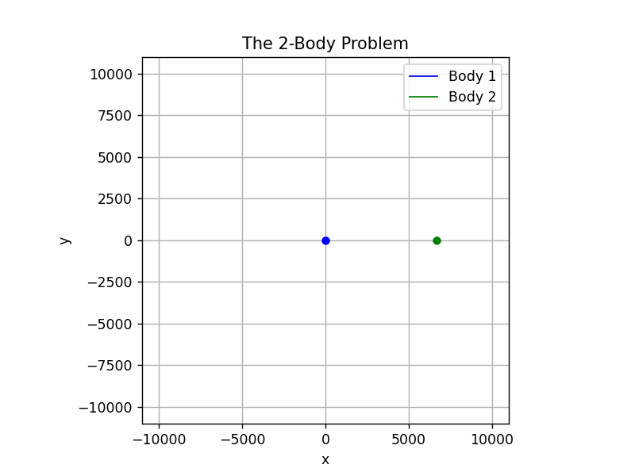
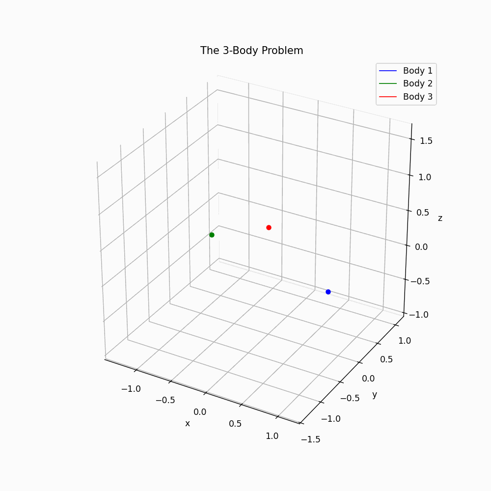

# N-Body Orbital Simulator

## Project Overview

**N-Body Orbital Simulator** is a Python-based tool for simulating and visualizing the motion of multiple celestial bodies under mutual gravitational attraction. It supports impulsive maneuvers (propulsion events) and provides animated visualizations of orbital trajectories in 2D or 3D.

<p align="center">
  
  
</p>

## Key Features

- Simulate gravitational interactions between any number of bodies
- Numba-optimized physics engine for fast N-body numerical integrations
- Add impulsive maneuvers (velocity changes) at specified times
- Visualize orbits and maneuvers with Matplotlib animations
- Supports both 2D and 3D simulations
- Customizable animation options (trail, speed, centering, relative mass display)
- Comprehensive mission reporting tools (energy analysis, relative distance tracking, maneuver summaries)
- Includes orbital maneuver utilities for:
  - Coplanar Hohmann transfers
  - Hyperbolic capture calculations for interplanetary missions
  - Periapsis detection for maneuver targeting


## Getting Started

### Installation

1. Clone this repository:
   ```bash
   git clone https://github.com/Samsaj04/N-Body-Orbital-Simulator.git
   cd N-Body-Orbital-Simulator
   ```
2. Install dependencies:
   ```bash
   pip install -e .
   ```

### Usage

All simulation setup and execution is done in `example.py`. To run the simulator, simply execute:

```bash
python example.py
```

#### How to Use

1. **Create Body objects**
   - Each `Body` represents a celestial object (planet, satellite, etc.).
   - Required attributes: `position` (vector), `velocity` (vector), and `mass` (scalar).
   - Example:
     ```python
     earth = Body(position=np.array([0.0, 0.0]), velocity=np.array([0.0, 0.0]), mass=5.972e24)
     satellite = Body(position=np.array([r1, 0.0]), velocity=np.array([0.0, V_r1]), mass=1)
     ```

2. **Define Propulsion events (optional)**
   - Use `Propulsion` to specify maneuvers (impulses) for the spacecraft.
   - Attributes: `tf` (time of maneuver), `dVx`, `dVy`, `dVz` (velocity changes in each component).
   - Important: Note that a positive dV value indicates an increase in velocity magnitude, whereas a negative dV indicates a decrease in magnitude, rather than a simple algebraic vector addition to the coordinate axes.
   - Example:
     ```python
     impulse = Propulsion(tf=1000, dVx=0.5, dVy=0.0, dVz=0.0)
     ```

3. **SimulationController**
   - This class manages the simulation, integrating all bodies and maneuvers.
   - Required attributes:
     - `bodies`: List of all `Body` objects (the last one should be the spacecraft if it performs maneuvers)
     - `G`: Gravitational constant
     - `ti`: Initial time
     - `tf`: Final time
     - `step`: Total number of integration steps used across the complete simulation
     - `impulse`: List of all `Propulsion` events (optional)
   - Example:
     ```python
     controller = SimulationController(
         bodies=[earth, satellite],
         G=G,
         ti=0,
         tf=10000,
         step=10000,
         impulse=[impulse]
     )
     ```
   - **Note:** If you have a spacecraft performing maneuvers, it must be the last `Body` in the list. Currently, impulses are only applied to the last body.

4. **Run the simulation**
   - Call `run_solution()` on your `SimulationController` object to compute the trajectories:
     ```python
     orbits = controller.run_solution()
     ```

5. **Mission Reporting**
   - Create a `MissionReport` object to analyze simulation data, evaluate orbital energy, and plot relative distances:
     ```python
     report = MissionReport(simulation=controller, orbit=orbits)
     report.mission_log(plot=True)
     ```

6. **Visualization**
   - Create a `Visualizer` object to plot or animate the mission:
     - `bodies`: List of bodies
     - `orbit`: Output from `run_solution()`
     - `speed`: Animation speed
     - `follow`: Controls the trail length (higher = longer trail)
     - `centered`: If `True`, the plot is centered on the system barycenter; if `False`, shows the full domain
     - `rel_mass`: If `True`, marker size is proportional to mass
   - Example:
     ```python
     viz = Visualizer(
         bodies=[earth, satellite],
         trajectories=orbits,
         follow=np.inf,
         speed=5,
         centered=False,
         rel_mass=False
     )
     ```
   - To plot a static image:
     ```python
     viz.plotting(True)
     ```
   - To animate:
     ```python
     viz.animate()
     ```
   - To export animation:
     ```python
     viz.export_animation("file_name.gif")
     ```

## Support & Documentation
 
- For questions or issues, please open an issue in this repository.

## Maintainers & Contributions

- Maintained by: Samuel Jiménez Arroyave
- Please submit pull requests or open issues for suggestions.